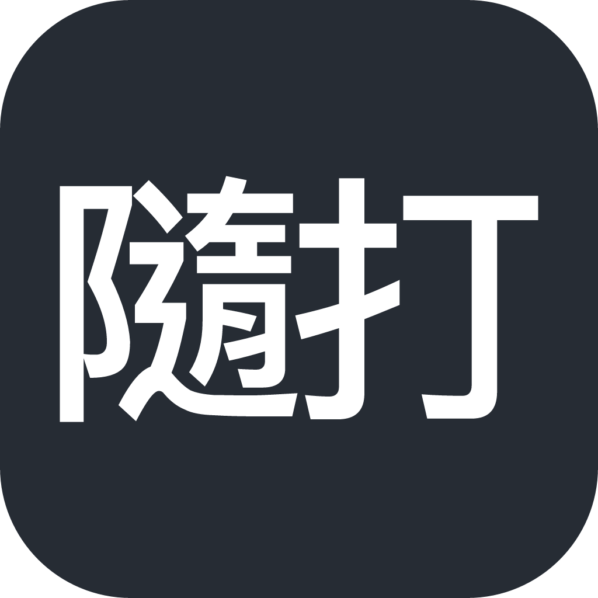

  
   <i>Type Zhuyin. Skip the tones.</i>

  <h1>Misstype (隨打注音)</h1>

  
A Zhuyin input method with optional tones and automatic typo repair. Zig core · macOS (IMK) and Linux (fcitx5) · offline · MIT

  

  
  
  
  
  
  

  
<a href="README.md">繁體中文</a> · <b>English</b> · <a href="docs/architecture.md">Architecture</a> · <a href="CONTRIBUTING.md">Contributing</a> · <a href="docs/development.md">Development</a>

Misstype is a Zhuyin (Bopomofo) input method built around two things:

- **Tone-optional continuous typing**: skip the tones and the per-character candidate picking. Keep typing and the whole sentence is assembled from context.
- **Automatic typo repair**: neighboring-key slips, swapped order, and extra or missing keys are repaired toward what you meant, without affecting correct input.

Everything runs locally; no network is needed. The project is still experimental: it validates the typing model in software before deciding on custom hardware.

> [!IMPORTANT]
> This project is developed entirely with LLMs, and will keep being developed, delivered and tested by LLMs. Bug reports and feature prompts are welcome, and regular contributions are very welcome too, but be prepared for them to be closed and redone from scratch XD

## Why another input method?

Because I wanted one for myself. It started with wanting to type without even opening my eyes: keep going, skip the tones, fingers not too precise, and let the input method guess what I meant.

Back when I used Rime, teaching it a word meant typing it on purpose, picking the right characters and deleting the extras, and I never found a quick key for editing the dictionary. Yahoo KeyKey and vChewing felt much smoother, so "<kbd>Shift</kbd>+<kbd>←</kbd>/<kbd>→</kbd> marks, <kbd>Return</kbd> adds the word" here follows their feel.

Tones are optional and typos are repaired by default; turn that off if you want it strict. Many keyboard layouts, Simplified/Traditional switching and Cangjie/Quick are not planned for now. If you just want a mature, stable daily input method, vChewing is great, use that; if you have the same lazy itch, come play.

## How it compares

> [!NOTE]
> Comparison tables like this inherently skew toward "features we built, so our product always wins"—take it with a grain of salt XD.
>
> This is not an IME scorecard or feature-matrix contest. Mature projects (such as vChewing, McBopomofo, Rime, ChiaKey, etc.) each excel in daily stability, deep feature sets, diverse layout support, or cross-platform maturity. This table serves strictly as a design baseline and reference coordinate for Misstype's experimental directions (toneless continuous typing, fuzzy typo correction, and unswitched mixed Chinese/English).

Based on each project's public description (snapshot 2026-10-04, not hands-on tested). `-` means no public mention was found, not that the feature is absent.

| | Misstype | ChiaKey | vChewing | McBopomofo | Rime (Squirrel etc.) |
| --- | --- | --- | --- | --- | --- |
| Tones optional | ✓ | - | partial (Zhuyin Furious Typing, off by default) | - | ✓ |
| Typo repair (neighbor keys, swaps, extra/missing) | ✓ | - | - | - | partial (order within a syllable; the engine also has an off-by-default typo corrector) |
| Chinese/English mixing, no mode switch | ✓ (off by default on macOS) | - | ✓ | - | - (needs a switch) |
| English typo repair | ✓ | - | - | - | - |
| User dictionary and learning | ✓ | ✓ | ✓ | ✓ | ✓ |
| Offline by default | ✓ | ✓ | ✓ | ✓ | ✓ |
| Platforms | macOS, Linux | macOS, Windows (preview) | macOS | macOS, Windows, Linux, web (separate projects) | macOS, Windows, Linux |

For the full comparison (platforms, licenses, download sizes) see [Competitor comparison](docs/competitors-en.md).

## Install

### macOS

Download `Misstype-<version>.dmg` from [GitHub Releases](https://github.com/Yukaii/misstype/releases/latest), open it and run **Install Misstype**. The input method installs into your user folder (no admin password) and updates itself through Sparkle. After the first install, log out and back in, then pick **隨打注音** (`Misstype Bopomofo`) from the input-source menu or System Settings → Keyboard → Input Sources.

### Linux

Supported as an fcitx5 addon sharing the same core as macOS. See the [Linux port](docs/linux-port.md) for install and status.

For Arch Linux / Omarchy, see [package build, installation and removal](docs/arch-linux.md).
An AUR submission candidate is available in `linux/aur/PKGBUILD`.

To build from source see [Development, build and release](docs/development.md).

## Usage

Type with the normal Zhuyin keyboard:
- **Continuous typing & optional tones**: tones are optional, and continuous typing converts as you go (only the syllable still being typed stays in Bopomofo). Tone keys finish syllables and <kbd>Space</kbd> represents the first tone.
- **Commit**: <kbd>Return</kbd> commits exactly what is shown, unfinished Bopomofo included (注音文 works); <kbd>Shift</kbd> + <kbd>Return</kbd> sends raw typed Bopomofo.
- **Candidate selection**: <kbd>↓</kbd> or <kbd>Tab</kbd> (or <kbd>←</kbd> to walk back to an earlier word) enters candidate selection mode, where home-row keys <kbd>asdfghjk</kbd> pick from the candidate panel (configurable in Preferences; they type Zhuyin outside this mode). <kbd>Tab</kbd> / <kbd>Shift</kbd> + <kbd>Tab</kbd> turn candidate pages. <kbd>Esc</kbd> leaves the selection mode; outside selection mode, <kbd>Esc</kbd> cancels the composition.
- **Symbols & English toggle**: <kbd>Shift</kbd> + digit keys and <kbd>Shift</kbd> + <kbd>=</kbd>, <kbd>[</kbd>, <kbd>]</kbd>, <kbd>&#96;</kbd> type full-width symbols (！＠＃＄％︿＆＊（）＋｛｝～). <kbd>Backspace</kbd> edits the raw composition; tapping <kbd>Shift</kbd> or pressing <kbd>Shift</kbd> + <kbd>Space</kbd> commits and toggles Chinese / English mode.
- **My dictionary**: while typing, <kbd>Shift</kbd> + <kbd>←</kbd>/<kbd>→</kbd> marks syllables of the converted text and <kbd>Return</kbd> adds the phrase (a name, jargon) to your own dictionary; <kbd>Return</kbd> on the same mark removes it. Settings → My Dictionary (macOS) is a plain-text editor over `user_dictionary.tsv`, which uses the vChewing user-data format (`word reading`, one per line) and has an Import… button for vChewing files. To turn a plain word list into that format, use the third-party [online generator](https://vu.gh.miniasp.com/) by Will 保哥 ([source](https://github.com/doggy8088/vChewing-userdata-generator), MIT; not affiliated with this project). On Linux edit `~/.local/share/misstype/user_dictionary.tsv` directly.
- **Learning**: Candidate selections are learned locally per word, and single characters are learned in context with the preceding word.

## Repository layout

| Path | What lives there |
| --- | --- |
| `core-zig/` | The single decoder and editing `Session`, exposed through a C ABI and a wasm32-wasi build |
| `Sources/` | macOS only: IMK adapter, Settings UI, installer (no decoding rules) |
| `linux/fcitx5/` | fcitx5 addon and GTK dictionary editor over the same core |
| `packages/misstype-wasm/` | npm browser bindings |
| `src/misstype/` | Python capture/touch prototype (reference for touch semantics only) |
| `tests/`, `tools/` | Golden files, replay fixtures, measurement scripts |
| `docs/` | Architecture, cross-platform contract (C1–C15), design notes |
| `site/` | Landing page and web editor (separate from this README by design) |

## Contributing

Read [CONTRIBUTING.md](CONTRIBUTING.md); agents also follow [AGENTS.md](AGENTS.md). Behavior changes need a replayable reproduction and a verification note in the PR; AI-assisted PRs disclose the model and harness.

## License

MIT (see `LICENSE`). The bundled dictionary data comes from McBopomofo (MIT) and libtabe (BSD-style); see `THIRD_PARTY_NOTICES.md`.
